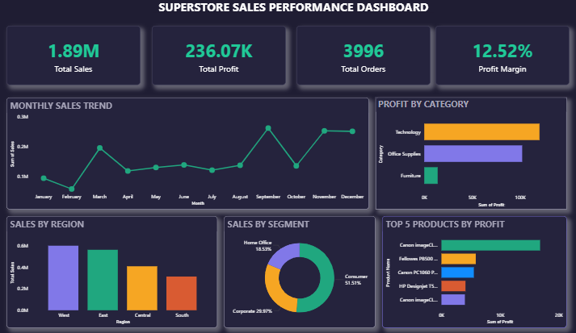

# 📊 Superstore Sales Performance Analysis

## 🚀 Project Overview

The **Superstore Sales Performance Analysis** is an end-to-end data analytics project built using **SQL and Power BI** to analyze sales performance, profitability, customer segments, and regional business trends.

This project focuses on transforming raw sales data into meaningful business insights through data analysis, SQL queries, KPI calculations, and interactive dashboard visualization.

---

## 🎯 Objectives

* Analyze overall sales and profit performance
* Identify monthly sales trends and business growth patterns
* Compare sales performance across different regions and segments
* Analyze category-wise profitability
* Identify top-performing products based on profit
* Build an interactive Power BI dashboard for data-driven decision making

---

## 🛠️ Tech Stack

* **SQL (Oracle/MySQL)** – Data cleaning, transformation, aggregation, and business analysis queries
* **Power BI** – Dashboard development and interactive data visualization
* **DAX** – Calculated measures and KPI creation
* **Excel/CSV** – Dataset handling and preprocessing

---

## 📂 Project Structure

```
Superstore-Sales-Analysis/
│
├── dataset/
│   └── Sample_Superstore.xlsx
│
├── sql/
│   └── sales_dashboard_queries.sql
│
├── dashboard/
│   └── Superstore_Sales_Dashboard.pbix
│
├── images/
│   └── dashboard_screenshot.png
│
└── README.md
```

---

## 📊 Dashboard Features

* 🔹 KPI Cards

  * Total Sales
  * Total Profit
  * Total Orders
  * Profit Margin

* 🔹 Monthly Sales Trend Analysis (Line Chart)

* 🔹 Regional Sales Performance (Column Chart)

* 🔹 Segment-wise Sales Contribution (Donut Chart)

* 🔹 Category-wise Profit Analysis (Bar Chart)

* 🔹 Top 5 Products by Profit Analysis (Bar Chart)

* 🔹 Interactive business insights through Power BI visuals

---

## 📈 Key Insights

* Generated total sales and profit performance metrics
* Identified monthly sales fluctuations and peak sales periods
* Compared regional contribution towards overall sales
* Analyzed customer segment-wise purchasing behavior
* Found the most profitable product categories
* Identified top-performing products based on profit contribution

---

## 🖼️ Dashboard Preview



---

## ⚙️ How to Run the Project

1. Import the Superstore dataset into a SQL database
2. Execute SQL queries from the `sales_dashboard_queries.sql` file
3. Connect the analyzed data with Power BI
4. Open the Power BI dashboard file
5. Explore sales trends, profitability, and business insights using interactive visuals

---

## 💡 Future Enhancements

* Add advanced DAX calculations for deeper analysis
* Implement automated data refresh using Power BI Service
* Add customer-level segmentation analysis
* Build predictive models for future sales forecasting
* Integrate real-time sales data pipelines

---

## ✅ Conclusion

This project demonstrates how raw sales data can be transformed into actionable business insights using **SQL and Power BI**.

By analyzing sales trends, regional performance, customer segments, and product profitability, this dashboard helps understand business performance and supports data-driven decision making.

---

## 🤝 Connect With Me

I’m always open to feedback, collaboration, and opportunities in **Data Analytics and Business Intelligence**.

* 💼 LinkedIn: [www.linkedin.com/in/malini-selvi-murugesan](http://www.linkedin.com/in/malini-selvi-murugesan)

Feel free to connect and explore more of my data analytics projects! 🚀

---

⭐ If you found this project useful, consider starring this repository and follow for more SQL, Power BI, and Data Analytics projects.
